# Рендеринг порталов средствами OpenGL

В этом репозитории находится реализация рендеринга порталов с помощью OpenGL. Главной целью не была оптимизация, а было получение максимально корректно работающей программы при
* Большом количестве порталов самых разных форм
* Рендеринге поверхностных порталов
* Рендеринге портала в портале

Но всё-же для этих целей лучше использовать рейтрейсинг на видеокарте, ибо он будет в миллион раз быстрее для сложных сцен и для большой глубины.

Работающую программу можно посмотреть в секции [release](https://github.com/optozorax/portals_opengl/releases). Запуск:
`.\glut.exe <scene-name>.json`, например: `.\glut.exe simple_portals.json`. Программа запустит ту сцену, которая задана в json файле. Так же, вместо того, чтобы открывать консоль, можно пользоваться возможностями drag&drop'а, и просто навести нужную сцену на программу в проводнике.

Требования к версии OpenGL: не менее 3.0.

**Управление:** кликните правой кнопкой мыши, и там будут показаны все команды и кнопки для быстрого их вызова.

# Примеры сцен

**Внимание!** Все сцены, представленные здесь уже предрасчитаны, в них нельзя поменять никаких параметров и пересчитать. Движок по симуляции порталов не встроен в данную программу! Текущая программа может только визуализировать.

Все сцены находятся в папке `scenes`.

## Два портала друг напротив друга

Файл: `simple_portals.json`.

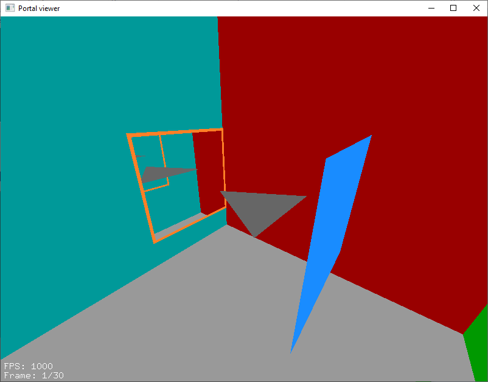

## Поверхностный портал

Файл: `surface_portal.json`.

Поверхностный портал - это портал, полученный соединением нескольких обычных порталов таким образом, что сохраняется непрерывность и целостность пространства с обоих сторон. Просто посмотрите на скриншоты, чтобы это понять. На основе этого базового концепта можно построить очень интересные порталы.

Я решил называть этот портал поверхностным, а не объёмным, потому что это плоская поверхность, а не что-то, имеющее объём. Настоящим объёмным порталом можно назвать [червоточину](https://sirxemic.github.io/wormhole/).

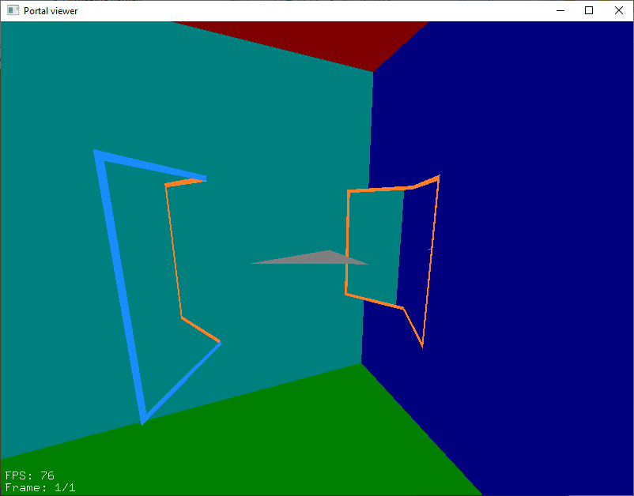

## Портал в портале

Файл: `portal_in_portal.json`.

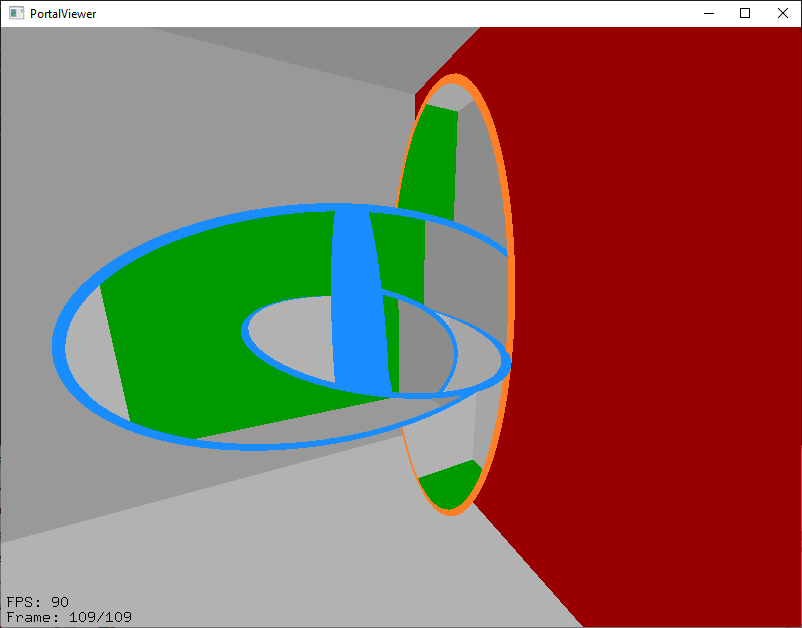

Файл: `portal_in_portal2.json` - немного в другом формате.

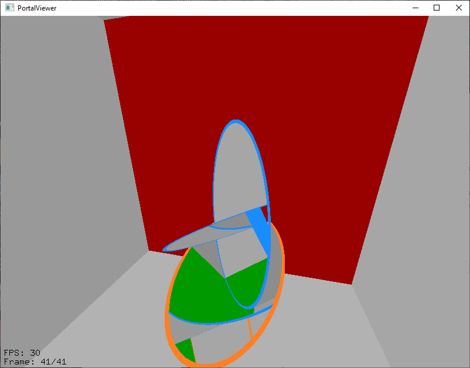

Вы задавались вопросом что будет если поместить один портал в другой? Я решил этот вопрос, написав собственный движок для симуляции этого процесса (который пока не опубликован). Затем преобразовал полученные данные в формат этого репозитория и получил текущий файл. Так же этот файл отрендерил при помощи [portals-tracing](https://github.com/optozorax/portals-tracing) и опубликал такое видео на ютубе:

[](http://www.youtube.com/watch?v=fWkAfa96OmI "Portal in portal simulation and rendening")

Иногда вы можете наблюдать глитчи при рендеринге последнего кадра. Это связано с тем, что не хватает глубины. Можете поставить глубину побольше через ПКМ, тогда глитчей будет поменьше, но дальше в портале они всё-равно будут видны. Единственное разумное решение у этой проблемы - рендерить рейтрейсингом.

## Объект, залетающий в портал в портале

Файл `object_fly_into_portal_in_portal.json`.

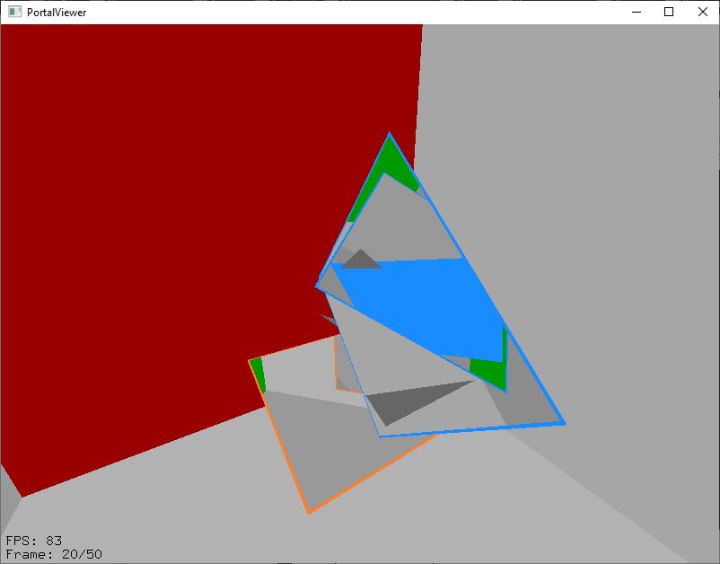

Здесь квадратный портал немного вошел в свою вторую половинку, и именно в эту часть залетает объект, показывается как он будет двигаться. Видно, что он движется по прямой, но в какой-то момент, можно увидеть одновременно 4 отражения объекта.

Так же на этой анимации тестируется движок на предмет правильности обрезания и телепортации объектов.

## Как работают двигающиеся порталы?

Файл `my_speed_model.json`.

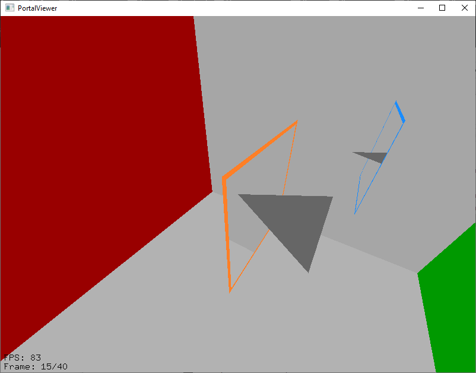

В интеренете идёт бурное обсуждение о том, как будут вести себя объекты при движении порталов, потому что там возникает много парадоксов и сложностей.

На этой анимации показано что произойдёт, если на объект летит портал. С одной стороны объект остаётся неподвижным, а с другой - он постоянно двигается. Именно с такой моделью скорости работает вычисление потрала в портале. Была ещё такая модель:

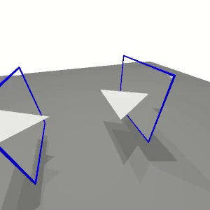

Но быстро стало понятно, что она тупиковая, и что с помощью неё нельзя вычислить портал в портале.

## Портал в портале (с 4 порталами)

Файл `portal_no_problem.json`.

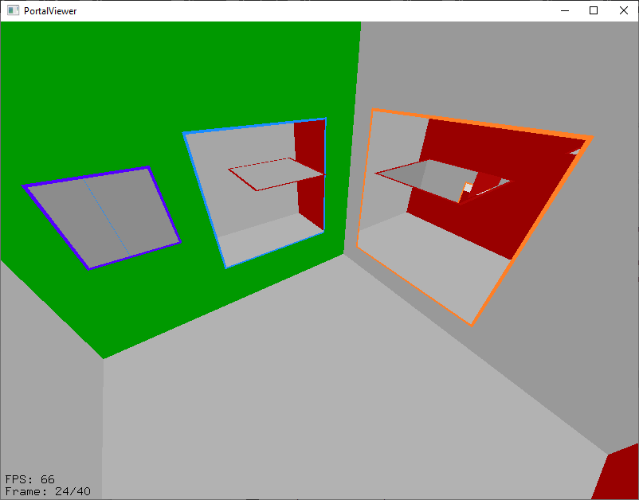

В этой анимации показан случай помещения "портала в портал", когда у нас не возникает никаких вопросов, где нет никаких парадоксов. Ведь порталов 4, и мы просто суём независимые. 

Кстати, суть вычисления портала в портале, который выше, как раз в том, чтобы разбить исходный портал на такие независимые порталы, где не возникает парадоксов телепортации.

Так же на этой анимации тестируется движок на предмет передачи скорости входящему и выходящему объекту.

## Портал, изменяющий масштаб мира

Файл: `scale_portal.json`.

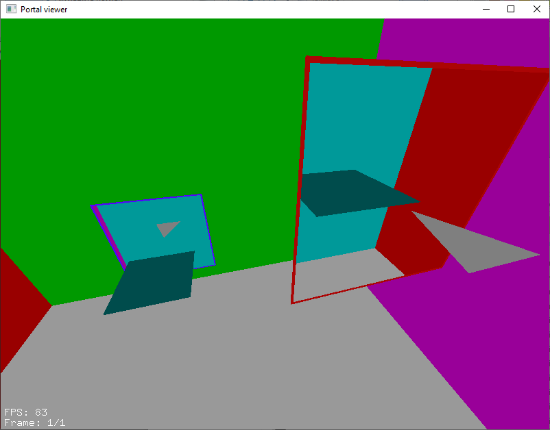

## Портал, изменяющий наклон мира

Файл: `slanted_portal.json`.

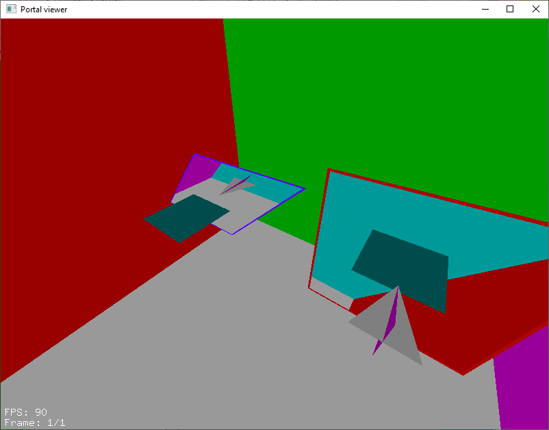

## Пропеллер из порталов

Файл `portal_propeller.json`.

Этот тест призван показать точность данной программы, и её способность обрабатывать нестандартные случаи рендеринга порталов. Другие подходы вряд ли могут похвастаться корректным рендерингом подобной сцены.

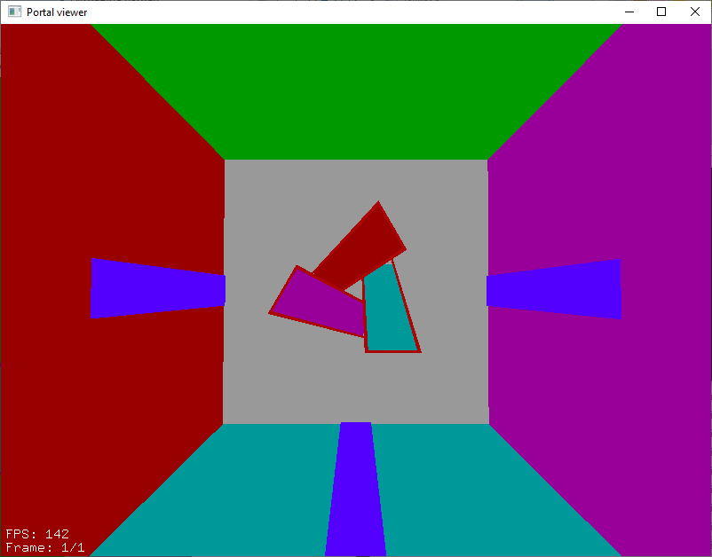

# Принцип работы рендеринга

Есть множество разных подходов к рендерингу портала, первый - это подход на основе stencil буфера, в нём вся сцена внутри портала рисуется с включенным трафаретом портала, то есть в итоге отобразится только нужная часть сцены. Проблема этого подхода в том, что он неправильно работает с буфером глубины, то есть нарисовать тот же пропеллер из порталов не получится. Решают иногда эту проблему принудительным рисованием в буфер глубины нужного нам полигона.

Пример программ, использующих stencil буфер: 
* [Mini-Portal_Recursive](https://en.wikibooks.org/wiki/OpenGL_Programming/Mini-Portal_Recursive).
* [Modern tutorials](https://gitlab.com/wikibooks-opengl/modern-tutorials/tree/master/mini-portal).
* [glPortal](https://github.com/SimonLarsen/glPortal).
* [Stackoverflow - how to implement portal rendering](https://stackoverflow.com/questions/38287235/opengl-how-to-implement-portal-rendering) - моя программа справится с таким случаем
* [Rendering recursive portals with OpenGL](https://th0mas.nl/2013/05/19/rendering-recursive-portals-with-opengl/).

Другой подход - это рисовать всю сцену в framebuffer, а затем только его часть отображать на экране, при этом задавая глубину такой, как будто рисуется полигон, здесь с буфером глубины всё ок, и пропеллер нарисуется. Именно такой подход и используется в данной программе.

Помимо этого есть ещё несколько трюков, о которых далее будет рассказано поподробнее.

Для начала у нас должны быть две функции: 
* Нарисовать всю сцену: сначала рисуются порталы, затем простые полигоны.
* Нарисовать конкретный портал вместе с его содержимым.

Эти функции в процессе рекурсивно вызывают друг друга.

Основной код рендеринга порталов находится в `src/prtl_vis/opengl_common.cpp` в функциях `SceneDrawer::drawPortal` и `SceneDrawer::drawScene`.

## Работа с framebuffer'ами

Framebuffer - объект, содержащий в себе буфер глубины и буфер цвета.

Можно перенаправить рисование не на экран, а в этот фреймбуфер. Обычно это используются для пост-обработки, или чтобы показать как выглядит буфер глубины, как в [этой статье на хабре](https://habr.com/ru/post/344238/).

Примеры для framebuffer'ов находятся в файле `tests/torus.cpp`.

Главное место, где сосредоточена работа с framebuffer'ами - это файл `include/prtl_vis/framebuffer.h`.

Действия над фреймбуферами:

* **Включение/выключение.** При включении рисование перенаправляется на текущий фреймбуфер, а при выключении рисование перенаправляется обратно. Причем поддерживается возможность рекурсивно включать фреймбуферы.

* **Нарисовать содержимое фреймбуфера на экран.**

* **Объединить два фреймбуфера.** Каждый фреймбуфер - это не только цветная картинка, но ещё и карта глубины, поэтому их объединение заключается лишь в выборе пикселей, которые удовлетворяют тесту глубины, то есть самых ближних пикселей из двух фреймбуферов. Это работает как магия, когда мы можем просто объединить две картинки, и они будут выглядеть так, как будто мы всё это рендерились вместе.

* **Нарисовать только ту часть фреймбуфера, которая попадает на полигон** - самое главное действие для этой библиотеки. Причем нарисовать так, чтобы в буфере глубины была не глубина из фреймбуфера (тогда такой подход ничем не будет отличаться от stencil), а глубина текущего полигона. Получается, текущий полигон выступает в роли экрана, на котором показывается картинка с миром по ту сторону портала.

Все эти операции реализуются через шейдеры.

Большое спасибо этим источникам:
* [Stackoverflow - Render the depth buffer in OpenGL without shaders](https://stackoverflow.com/questions/24266815/render-the-depth-buffer-in-opengl-without-shaders)
* [Framebuffers](https://learnopengl.com/Advanced-OpenGL/Framebuffers).
* [Tutorial 14 : Render To Texture](http://www.opengl-tutorial.org/ru/intermediate-tutorials/tutorial-14-render-to-texture/).

## Ориентация полигона по часовой стрелке и против неё. Обратная сторона портала

В OpenGL есть такое понятие, как передняя и задняя сторона. Вычисляется она при помощи определения как ориентирован спроецированный на экран полигон: по часовой стрелке или нет. В зависимости от этого определяется какую сторону полигона мы видим. К сожалению, алгоритм этого определения не такой тривиальный, как хотелось бы, и если представить более-менее сложный полигон, то вообще становится непонятно что тут ориентация по часовой стрелке, а что против неё. Спасибо [stackoverflow](https://stackoverflow.com/questions/14505565/detect-if-a-set-of-points-in-an-array-that-are-the-vertices-of-a-complex-polygon) за готовый алгоритм. 

Для проецирования полигона используется функция `include/prtl_vis/opengl_common.h`:`projectPolygonToScreen`.

Для определения ориентации полигона используется функция `include/prtl_vis/opengl_common.h`:`isPolygonOrientedClockwise`.

И для того, чтобы не рисовать лишний раз портал, когда мы видим его заднюю сторону, используется эта функция. Это не только увеличивает производительность, но и избавляет от лишней головной боли типо когда мы хотим скрыть заднюю сторону портала, пытаясь костыльно подставить туда очень близко полигон - вместо этого можно в принципе вместо задней части рендерить полигон.

## Не рисовать свою вторую половинку

Мы смотрим на синий портал, видим из него мир, и в этом мире рекурсивно рисуем все остальные порталы, в частности оранжевый портал. А оранжевый портал находится для нас в том же месте, что и синий, после преобразования координат. И получается, что вместо того, чтобы увидеть всю сцену через синий портал, мы увидим в первую очередь заднюю часть оранжевого портала. Именно для того, чтобы это не случалось, нужно поставить такую проверку: не рисовать свою вторую половинку.

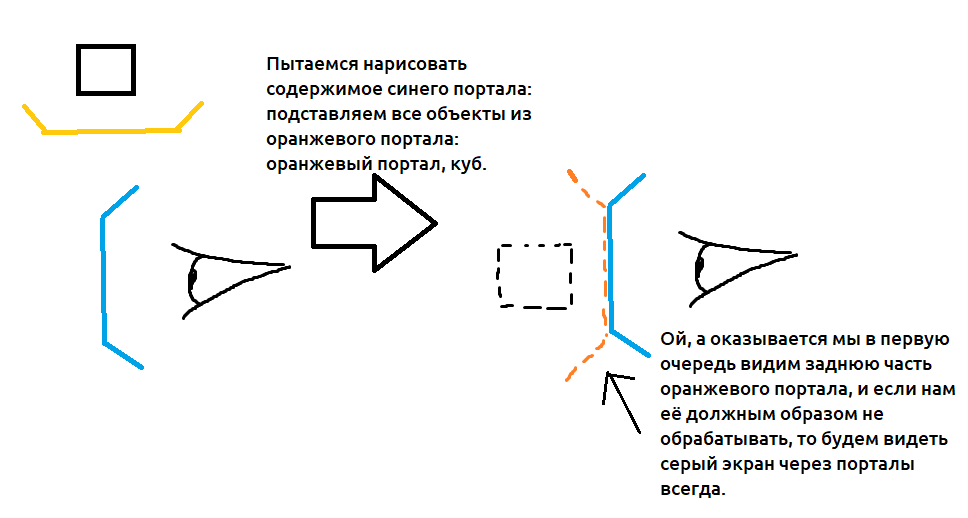

## Тесселяция полигонов

В OpenGL с помощью `glBegin(GL_POLYGON)` можно нарисовать только выпуклый полигон. Поэтому никаких сложных полигонов в виде буквы С. 

Именно для того чтобы нарисовать их, используется тесселяция. Большое спасибо [этому сайту](http://www.songho.ca/opengl/gl_tessellation.html), на основе которого сделана тесселяция в этом проекте.

Для работы с тесселированными полигонами имеется файл `include/prtl_vis/fragment.h`. Там можно не только разбить полигон на примитивы, но ещё и учитывать координаты текстуры. Так же там же можно нарисовать эти штуки.

## ClipPlane

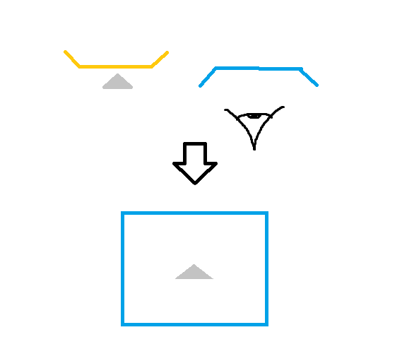

Представим, что мы смотрим на синий портал, а за оранжевым у нас находится полигон. Теперь представим, что мы нарисовали содержимое синего портала, но почему-то мы видим этот полигон, хотя он содержится за порталом. Это проблема того, что мы видим те объекты, которые не должны видеть. Тут нам на помощь приходит clip plane - плоскость, обрезающая всю геометрию на два полупространства. Ставим такую плоскость, чтобы она оставляла только то, что находится по ту сторону плоскости портала, и мы больше не видим лишних полигонов.

Но мы ограничены в этих плоскостях, поэтому будем использовать одновременно только одну.

Специально для этого есть файл `include/prtl_vis/plane.h`, там есть возможность рекурсивно включать и выключать обрезающие плоскости. Сделано аналогично framebuffer'ам.

## Преобразования координат

У нас есть исходная сцена. Как нам получить сцену, которую мы увидим сквозь портал? Применить к ней преобразования координат! Порталы по сути есть простые преобразования координат, которые смещают и поворачивают сцену. А если вдаваться в подробности, то сначала вся сцена записывается в относительных координатах первого портала, а затем переводится из относительных координат второго портала в абсолютные.

Поэтому каждый раз при рисовании того или иного портала к модельно-видовой матрице применяются преобразования координат. А после работы с текущим порталом, применяется обратная матрица преобразования координат, чтобы вернуть всё к прежнему виду.

Для преобразования координат используется библиотека `glm`, а для работы с осями координат и получения матриц библиотека `spob`.

## Оптимизация с помощью алгоритмов объединения полигонов

Самая дорогая операция - нарисовать портал. Потому что при рисовании потрала в нём есть не только вся сцена, но ещё и другие порталы, которые рекурсивно рисуются. Поэтому мы должны любыми способами отсекать те порталы, которые заведомо не будут видны на экране. По-любому выиграем в скорости работы.

Именно так и делается в программе. При рисовании каждого портала определяется текущая видимая область. При помощи библиотеки `clipper` находится объединение этой области с спроецированным полигоном портала, благодаря чему можно определить, когда эта область нулевая и просто не рисовать не видимый портал.

Это дает значительный прирос производительности, несмотря на то, что операция нахождения пересечения полигонов - очень дорогая.

Конечно, можно ещё сделать такую оптимизацию, чтобы из полигона видимости ещё вычитался полигон, который перекрывает портал на экране. Но в этой программе такое не реализовано.

## Интеграция всего этого ⇒ БАГИ

Рисуешь фреймбуфер на полигон при помощи шейдеров, но в шейдерах ClipPlane по умолчанию не учитывается и ты про это не знал? БУМ, У ТЕБЯ БАГ. [Решение](https://github.com/optozorax/portals_opengl/blob/bed73e5d309e94f4be686b37d93731ef91ff53b3/glsl/drawpoly.vertex.glsl#L7).

При возвращении обрезающей плоскости забыл что ты изменил координаты, и на самом деле ты не возвращаешь ту плоскость, а добавляешь другую? БУМ, У ТЕБЯ БАГ. [Решение](https://github.com/optozorax/portals_opengl/blob/bed73e5d309e94f4be686b37d93731ef91ff53b3/src/prtl_vis/opengl_common.cpp#L137).

Сделал портал, у которого левосторонняя система координат, после которой ориентация по часовой стрелке меняется на против-часовой, и внутри обратная сторона портала меняется местами с передней? БУМ, У ТЕБЯ БАГ. [Решение](https://github.com/optozorax/portals_opengl/blob/bed73e5d309e94f4be686b37d93731ef91ff53b3/src/prtl_vis/opengl_common.cpp#L120).

*Вывод:* порталы, одна из самых коварных вещей, что я встречал в своей жизни, и они создают баги на пустом месте. Благо в этом репозитории вроде всё работает хорошо... И то я уже ничему не верю, и ни на что не надеюсь. Если захотите рендерить порталы такой же сложности как у меня, то используйте мой код, либо просто переходите на рейтрейсинг. Вот какой черт вас укусил делать порталы на OpenGL? Рейтрейсить порталы - сплошное удовольствие, простое как два пальца. Пользуйтесь мощностью своих видеокарт.

[OpenGL Ray Tracer With Portals Demo](https://www.youtube.com/watch?v=dPdo1MLewaU).

# Компиляция

Зависимости: [glm](https://glm.g-truc.net/0.9.9/index.html), [glew](http://glew.sourceforge.net/), [glut](http://freeglut.sourceforge.net/), [spob](https://github.com/optozorax/space_objects), [clipper](http://www.angusj.com/delphi/clipper.php).

Используете CMake.

Требования к OpenGL: 3.3, так как используются framebuffer'ы.

Если у вас Linux, Intel HD Graphics, OpenGL 3.0, и программа вылетает с ошибкой, возможно вам помогут следующие команды в терминале:

```
export MESA_GL_VERSION_OVERRIDE=3.3
export MESA_GLSL_VERSION_OVERRIDE=330
```

Спасибо [StackOverflow: How can I get Opengl 3.3...](https://unix.stackexchange.com/questions/451160/how-can-i-get-opengl-3-3-with-glsl-3-3-support-through-mesa-on-an-intel-hd-gra), мне помогло.

# TODO

- [x] Makefile
- [x] Написать этот файл с объяснениями по-человечески, желательно с картинками.
- [x] Наконец опубликовать секретный проект и рассказать зачем же это всё было нужно
- [ ] Framebuffer multisample
- [ ] Translate to English